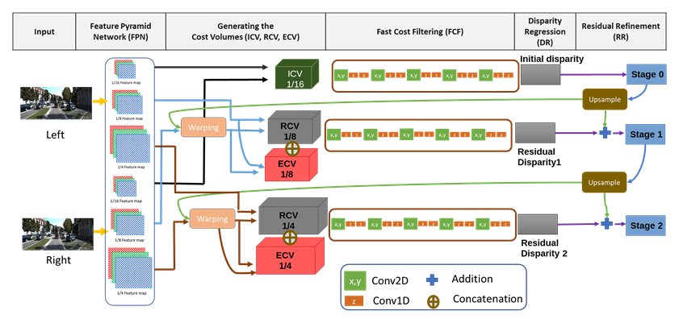

<!-- preview: ctrl+k v multi-cursor: shift+alt+i Head -->
# Multi-Scale Disparity Estimation (MSDE) Model

## **Contents**
- [Multi-Scale Disparity Estimation (MSDE) Model](#multi-scale-disparity-estimation-msde-model)
  - [**Contents**](#contents)
  - [Model Structure](#model-structure)
    - [MSDE Model](#msde-model)
  - [Folder Structure](#folder-structure)
  - [Requirements to run the code](#requirements-to-run-the-code)
  - [Dataset Path \& Structure](#dataset-path--structure)
  - [Main parameters to run the code](#main-parameters-to-run-the-code)
  - [How to run the code](#how-to-run-the-code)
    - [Training the model](#training-the-model)
    - [Finetuning the model](#finetuning-the-model)
    - [Resuming the model](#resuming-the-model)
    - [Testing the model](#testing-the-model)

---

## <a name= model>Model Structure</a>
### <a name= MSDE>MSDE Model</a>


---

## <a name= FolderStructure>Folder Structure</a>
```
📦M2-MSDE
 ┣ 📂dataloader
 ┃ ┣ 📜KITTILoader.py --> myImageFolder for KITTI 2015
 ┃ ┣ 📜KITTILoader1.py --> myImageFolder for KITTI 2012
 ┃ ┣ 📜KITTIloader2012.py --> Dataloader for KITTI 2012 path
 ┃ ┣ 📜KITTIloader2015.py --> Dataloader for KITTI 2015 path
 ┃ ┣ 📜listflowfile.py --> Dataloader for FT3D path
 ┃ ┣ 📜preprocess.py
 ┃ ┣ 📜readpfm.py
 ┃ ┣ 📜SecenFlowLoaderMy.py --> myImageFolder for FT3D
 ┃ ┗ 📜__init__.py
 ┣ 📂models
 ┃ ┣ 📜factorizer.py --> prepare factorizing of conv3d parameters
 ┃ ┣ 📜memory.py
 ┃ ┣ 📜plot.py
 ┃ ┣ 📜spatioTemporalConv_General.py --> Actual implementation of factorizing cost filtering layer
 ┃ ┣ 📜StereoNet_Multi.py --> for Original StereoNet model
 ┃ ┣ 📜StereoNet_Multi_FactorizedConv3D.py --> for Our model (SSDE)
 ┃ ┗ 📜StereoNet_Multi_SepConv.py
 ┣ 📂pretrainedModels --> contains pretrained models on FT3d
 ┣ 📂Readme_images
 ┃ ┣ 📜SSDE.PNG
 ┃ ┗ 📜orginalmodel.PNG
 ┣ 📂results --> contains results of running the code
 ┣ 📂utils
 ┃ ┣ 📜disp_to_color.py --> convert disparity image to colored image, save images
 ┃ ┣ 📜FinalQuant.py --> for quantizing the weights
 ┃ ┣ 📜folder_logs_init.py --> for creating the required result folders, initialzing logs 
 ┃ ┣ 📜logger.py
 ┃ ┣ 📜merge_freeze_model.py --> for merging and freezing a model
 ┃ ┣ 📜readpfm.py
 ┃ ┣ 📜save_load.py --> load dataset, load and save checkpoint, load qauntized model, save losses functions
 ┃ ┣ 📜stop_early.py --> for stop_early 
 ┃ ┣ 📜test.py --> main test function
 ┃ ┣ 📜train.py --> main train, adjust_learning_rate, and test_from_training functions
 ┃ ┣ 📜utils.py --> contains the loss, outliers functions
 ┃ ┗ 📜__init__.py
 ┣ 📜args_file.py --> This file contains the arguments or parameters that required to run the code
 ┣ 📜finetune_2012.sh --> script to finetune the pretrained model on KITTI 2012
 ┣ 📜finetune_2015.sh --> script to finetune the pretrained model on KITTI 2015
 ┣ 📜main_file.py --> main file code which called from args_file.py
 ┣ 📜README.md
 ┣ 📜resume.sh --> script to resume training
 ┣ 📜run.sh --> script to train the model on FT3d from scratch
 ┣ 📜test.sh --> script to test the model on FT3d
 ┣ 📜test_kitti_2012.sh --> script to test the model on KITTI 2012
 ┗ 📜test_kitti_2015.sh --> script to test the model on KITTI 2015
```

---

## <a name= reqs>Requirements to run the code</a>
- The main packages required to the this code are:
    - Python==3.6
    - torchsummary==1.5.1
    - torchtext==0.7.0
    - torchvision==0.7.0+cu101
    - apex==0.1
    - matplotlib==3.2.2
    - ninja==1.10.0.post2
    - numpy==1.19.0
    - opencv-python==4.2.0.34
    - pandas==1.1.0
    - Pillow==4.1.1
    - pytorch-memlab==0.2.1
    - pytorch-nemo==0.0.7
    - qtorch==0.2.0
    - termcolor==1.1.0
    - texttable==1.6.3
    - torch==1.6.0+cu101
    - torchaudio==0.6.0
    - torchprof==1.1.1    

---

## <a name= dataset>Dataset Path & Structure</a>
- ### <a name= FT3D>FlyingThings3D Dataset</a>
    **Dataset root path**: filepath= /home/alghoul/myenv/FlyingThings3D
    - **Training dataset path** :    
        - **image_left** = filepath+ /train/image_clean/left
        - **image_right** = filepath+ /train/image_clean/right
        - **disp_L** = filepath+ /train/disparity/left/
        - **disp_R** = filepath+ /train/disparity/right/
        - **disp_L_OCC** = filepath+ /train/disparity_occlusions/left/
    - **Testing dataet path**:
        - **image_left** = filepath+ /val/image_clean/left/
        - **image_right** = filepath+ /val/image_clean/right/
        - **disp_L** = filepath+ /val/disparity/left/
        - **disp_R** = filepath+ /val/disparity/right/
        - **disp_L_OCC** = filepath+ /val/disparity_occlusions/left/

- ### <a name= kitti2015>KITTI 2015 Dataset</a>
    **Dataset root path**: filepath= /home/alghoul/myenv/kitti2015/training
    - **Training and testing dataset**:
        - left_fold  = filepath + /image_2/
        - right_fold = filepath + /image_3/
        - disp_L = filepath + /disp_occ_0/
        - disp_R = filepath + /disp_occ_1/
        - disp_L_noc = filepath + /disp_noc_0/
        - mask_obj_map = filepath + /obj_map/

- ### <a name= kitti2012>KITTI 2012 Dataset</a>
    **Training root path**: datapath=/home/alghoul/myenv/kitti2012/training
    - **Training and testing dataset**:
        - left_fold  = filepath + /colored_0/
        - right_fold = filepath + /colored_1/
        - disp_L   = filepath + /disp_occ/
        - disp_L_noc = filepath + /disp_noc/

---

## <a name= args>Main parameters to run the code</a>
- These paramters are the main parameters to run the code:
    - ### Selecting the dataset
        - dataset: --> {sceneflow, kitti} To select the dataset
        - datapath: {/home/alghoul/myenv/FlyingThings3D,/home/alghoul/myenv/kitti2015/training,/home/alghoul/myenv/kitti2012/training} To select the root path of the datset. Note: This paremeters should match the the value of the "dataset" parameter
        - datatype: {2012, 2015} to select kitti version 2012 or 2015
        - flip_vertical: {0,1} This for KITII dataset to enable flipping the image up-down for 1 or no flipping
    - stages: --> {1,2,3,4} Number of stages
    - model: --> {org, cf_fact3d, cf_sepconv}  to select the model to run it. org: original model, cf_fact3d: SSDE model (ourmodel), cf_sepconv: eperable conolution model (not used)
    - mode: {train,finetune,test} To select mode of running
    - epochs: Number of epochs
    - lr: Learning rate vfalue {0.001}
    - train_bsize: Train batch size {4}
    - test_bsize: Test batch size {4}
    - save_path: {results}  the path of saving checkpoints, images, and log
    - print_freq: {30} How often epochs print the result on screen while training or finetuning
    - checkpoint_save_thr= {1} How often to save checkpoints
    - abs_thr={1,2,3} Absolute threshold to caluclate the loss
    - #### load pretrained model
        - loadmodel: {None,/pretrainedModels/org_2Stages_finetune_kitti2015-2020_10_19-21_44_15-epoch-1908-loss1-0.- 52-lossesSum-1.17-EarlyStopping-stereonet.pth} --> Load pretrained model for either finetuning or resuming the model. We save the pretrained model in the "pretrainedModels" folder on the root
    - #### quantization
        - with_quant: {0,1) --> 0: no quantization, 1: quatizing the model 
        - quantWL: {16} --> the whole word length in quantization
        - quantFL: {8} --> the Float point length in quantization
        - ####for testing
    testFile: {None, /checkpoint_finetune_kitti2015-2020_12_04-21_28_07-epoch-4000-loss1-0.317-lossesSum-4.- 391.pth} --> the path of the checkpoint used if we put the value of mode = test
    - ### for resuming
        - resume: {0,1} --> 0: no resuming, 1: enable resuming
        - resumeFile: {None, /kitti_model_cf_fact3d_3stages/checkpoints/- cf_fact3d_fin_kitti-2015-2020_12_19-16_03_29-epoch-2-loss2-10.031-lossesSum-31.297.pth} --> The path of the resume file if enable resume
    - #### for SSDE model=cf_fact3d (our model)
        - model_bn:{0,1} --> for enabling Batch Normalized (BN) layers in whole the model or not. 1: enable BN according to the BN_1D_last or (BN_1D and BN_2D) values. 0: disable BN regardless of BN_1D_last,BN_1D and BN_2D values.
        -BN_1D_last: {0,1} --> enforcing BN for the last conv1D in factorized conv3d layers regardless of BN_1D and BN_2D values. 0: use BN_1D and BN_2D values for BN
        - BN_1D: {0,1} --> 0: don't use batch normalized with Conv1D layer in factorizing, 1: use batch normalized with Conv1D layer in factorizing
        - BN_2D: {0,1} --> 0: don't use batch normalized with Conv2D layer in factorizing, 1: use batch normalized with Conv2D layer in factorizing
        - fact_kernels: Kernel values for each conv1d or conv2d layers for the factorizing conv3d layers. you can use multiple kernels. space required between every kerenl, No spaces or comma required between the values of the same kernal. For example to use four kernels, we write them as 331 131 113 311
        - filter1_kernels: The same as above fact_kernels argument, but it used for the layers in the first cost filtering block. This option is enabled if the is_filter1_differ argument is equal 1.
        - is_filter1_differ: {0, 1} --> To use different kernel sizes and conv layers in the first component of the cost filtering layer. 1: use the kernels in filter1_kernels argument for the first filtering block. 0: dont use different kernels for the first filtering block.
---

## <a name= run>How to run the code</a>

### <a name= train>Training the model</a>
- To train the model from scratch using FT3D run "run.sh" script
- Note: refer to the [Main parameters to run the code](#args) for more help
---

### <a name= finetune>Finetuning the model</a>
- To finetune the model using A pretrained model you can run the script:
    - finetune_2012_V18.sh --> to finetune on KITTI 2012
    - finetune_2015_V18.sh --> to finetune on KITTI 2015
- Note: refer to the [Main parameters to run the code](#args) for more help
---

### <a name= resume>Resuming the model</a>
- To resume the model you can run "resume.sh" script

---

### <a name= test>Testing the model</a>
- To test the model you can run the following script:
    - test_V18.sh --> test the model on FT3D dataset
    - test_kitti_2015.sh --> test the model on KITTI 2015 dataset
    - test_kitti_2012.sh --> test the model on KITTI 2012 dataset